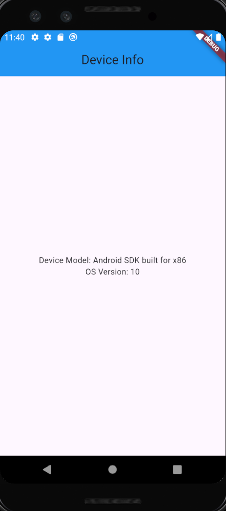

# Device Info App

This is a simple Flutter application that retrieves and displays basic device information using the `device_info_plus` package. It shows the device model and the Android OS version.

## Features

- Retrieves the device model (e.g., "Pixel 5").
    
- Retrieves the Android OS version (e.g., "12").
    
- Displays the information in a clean and simple UI.
## Screenshots

## Code Overview
### Dependencies

- [`device_info_plus`](https://pub.dev/packages/device_info_plus): A Flutter plugin to access device information.
### Main Components

1. **`DeviceInfoScreen` Widget**:
    
    - A `StatefulWidget` that fetches and displays device information.
        
    - Uses the `DeviceInfoPlugin` to retrieve Android device details.
        
2. **`getDeviceInfo` Method**:
    
    - Asynchronously fetches device information using the `device_info_plus` package.
        
    - Updates the state with the retrieved data.